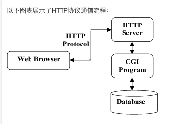
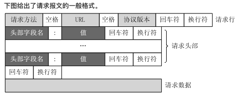

# HTTP

## 简介

HTTP协议是Hyper Text Transfer Protocol（超文本传输协议）的缩写，是用于从万维网（WWW：World Wide Web）服务器传输超文本到本地浏览器的传送协议

HTTP协议是基于TCP/IP通信协议来传递数据

## 工作原理

HTTP协议工作与客户端-服务端架构上。浏览器作为HTTP客户端通过URL向HTTP服务器即WEB服务器发送所有请求。

HTTP默认端口为80，也可以改为8080或者其他端口

### 注意事项

HTTP是无连接：无连接的含义是限制每次连接只处理一个请求。服务器处理完客户的请求，并受到客户的应答后，即断开连接。采用这种方式可以节省传输时间。

HTTP是媒体独立的：这意味着，只要客户端和服务器知道如何处理的数据内容，任何类型的数据都可以通过HTTP发送。客户端以及服务器指定使用适合的MIME-type内容类型

HTTP是无状态的：无状态是指协议对于事物处理没有记忆能力。缺少状态意味着如果后续处理需要前面的信息，则它必须重传，这样可能导致每次连接传送的数据量增大。另一方面，在服务器不需要先前信息时它的应答就较快。

#### 注释

媒体类型（MIME-type）通常通过 HTTP 协议，由 Web 服务器告知浏览器的，更准确地说，是通过 Content-Type 来表示的。

### 协议通信流程

## 消息结构

HTTP是基于客户端/服务端（C/S）的架构模型，通过一个可靠的链接来交换信息，是一个无状态的请求/响应协议。

一个HTTP"客户端"是一个应用程序（Web浏览器或其他任何客户端），通过连接到服务器达到向服务器发送一个或多个HTTP的请求的目的。

一个HTTP"服务器"同样也是一个应用程序（通常是一个Web服务，如Apache Web服务器或IIS服务器等），通过接收客户端的请求并向客户端发送HTTP响应数据。

**HTTP使用统一资源标识符（Uniform Resource Identifiers, URI）来传输数据和建立连接。**

### 客户端请求信息

客户端发送一个HTTP请求到服务器的请求消息包括以下格式：请求行、请求头、空行、请求体四部分

### 服务器响应信息

响应也由4个部分组成，分别是：状态行、消息报头、空行和响应正文

## HTTP请求方法

HTTP1.0定义了三种请求方法：GET、POST和HEAD方法

HTTP1.1新增了六种请求方法：OPTIONS、PUT、PATCH、DELETE、TRACE和CONNECT方法

### GET方法

请求指定的页面信息，并返回实体主体

### HEAD方法

类似于GET请求，只不过返回的响应中没有具体的内容，用于获取报头

### POST方法

向指定资源提交数据进行处理请求（例如提交表单或者上传文件）。数据被包含在请求体中。POST请求可能会导致新的资源的建立和/或已有资源的修改。

### PUT请求

从客户端想服务器传送的数据取代指定的文档的内容。

### DELETE请求

请求服务器删除指定的页面

### CONNECT请求

HTTP1.1协议中预留给能够将连接改为管道方式的代理服务器

### OPTIONS请求

允许客户端查看服务器的性能

### TRACE请求

回显服务器收到的请求，主要用于测试或诊断

### PATCH请求

是对PUT请求的补充，用来对已知资源进行局部更新

## HTTP状态码

​		当浏览者访问一个网页时，浏览者的浏览器会向网页所在服务器发送请求。当浏览器接收并显示网页前，此网页所在的服务器会返回一个包含HTTP状态码的信息头用以响应浏览器的请求。

### 常见的状态码

200-请求成功

301-资源被永久转移到其他URL

404-请求的资源不存在

500-内部服务器错误

### 状态码分类

​		HTTP状态码有三个十进制数字组成，第一个十进制数字定义了状态码的类型，后两个数字没有分类的作用。HTTP状态码共分为5类

1**：信息，服务器收到请求，需要请求者继续执行操作。

2**：成功，操作被成功接收并处理。

3**：重定向，需要进一步的操作以完成请求。

4**：客户端错误，请求包含语法错误或无法完成请求。

5**：服务器错误，服务器在处理请求的过程中发生了错误。

### 状态码列表

参考网页https://www.runoob.com/http/http-status-codes.html

## HTTP content-type

​		Content-Type（内容类型）：一般值网页中存在的Content-Type，用于定义网络文件的类型和网页的编码，决定浏览器将以什么形式、什么编码读取这个文件，这就是经常看到一些PHP网页点击下载一个文件或一张图片的原因。

### HTTP content-type 对照表

参考网页：https://www.runoob.com/http/http-content-type.html
